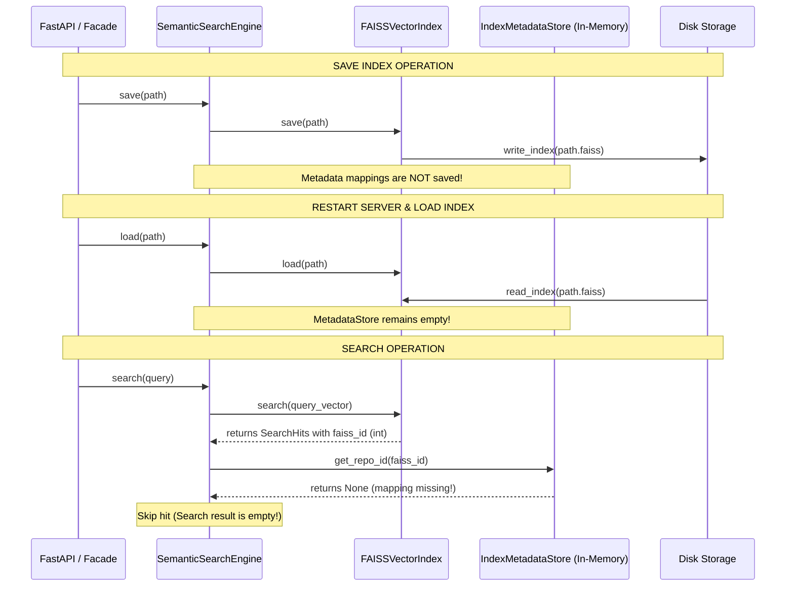
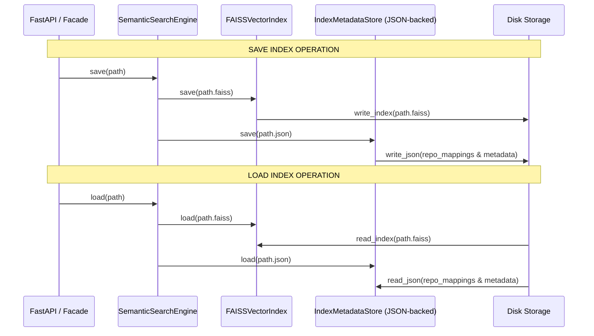

# AI-Search Project Production-Readiness Audit

This document provides a comprehensive production-readiness audit of the `ai-search` module. It reviews the architecture, code quality, performance, security, thread safety, configuration, and integration of the AI module within the Repository Discovery Platform.

---

## Executive Summary & Production Readiness Score

Based on our comprehensive review of the code, tests, and backend integration, the **ai-search** branch in its current state is **NOT production-ready**. 

### Production Readiness Score: 15 / 100

```
[███░░░░░░░░░░░░░░░░░] 15%
```

#### Rationale for Score:
1. **Critical Code Gaps (Blockers):** The entire `ai.models` package (containing schemas and exceptions like `ComparisonResult` and `AIModuleError`) is missing from the Git repository. As a result, the code cannot be imported or run, and the FastAPI backend crashes immediately on startup.
2. **Bypassed AI Integration (Fake Backend):** The FastAPI backend endpoints (Search, Recommendation, Compare, Analyze) completely bypass the `AIFacade` and the AI search module. Instead, they make raw, synchronous calls to the public GitHub API and return mocked, hardcoded slices of string or mock scores.
3. **Data Loss & Corruption Risks:** There is no persistence layer for the index metadata mapping table. On restart, the semantic search index becomes useless. Additionally, the index relies on Python's built-in non-deterministic `hash()` function, which randomizes IDs across runs and will corrupt index operations under multiple workers.
4. **Missing Test Coverage & Scripts:** The repository ranking engine has 0% actual test coverage (the test file contains empty `pass` methods), and all CLI orchestration scripts (`setup.py`, `build_index.py`, `test_pipeline.py`) are empty stubs.

---

## 1. Critical Issues (Blockers)

These issues cause immediate crashes, data loss, or deadlock conditions in a production environment.

### 1.1. Missing `ai/models` Directory
* **Symptom:** `ModuleNotFoundError: No module named 'ai.models'` during test collection and server startup.
* **Details:** The package `ai/models` (which should contain `comparison.py`, `exceptions.py`, `recommendation.py`, `repository.py`, and `search_result.py`) was never committed to the repository. The orchestrator `ai/facade.py` and the backend `app/main.py` directly import from these missing modules, breaking the application entirely.

### 1.2. In-Memory Only Metadata Mapping (Data Loss)
* **Symptom:** Search returns zero hits after loading a saved index.
* **Details:** `SemanticSearchEngine.save(path)` writes the FAISS vector index to disk, but the `IndexMetadataStore` mapping table (which translates FAISS integer IDs to repository metadata) is kept purely in-memory. When the server restarts and calls `SemanticSearchEngine.load(path)`, the metadata store is empty, causing search hits to be discarded:
  ```python
  repo_id = self._metadata_store.get_repo_id(faiss_id)
  if repo_id is None:
      continue  # Discards all hits because the map is empty
  ```

### 1.3. Non-Deterministic Repository ID Hashing (Index Corruption)
* **Symptom:** Lookups, updates, or deletions target the wrong records after a process restart.
* **Details:** `FAISSVectorIndex.hash_id()` maps string repository IDs to 64-bit integers using Python's built-in `hash()` function:
  ```python
  @staticmethod
  def hash_id(repo_id: str) -> int:
      return int(hash(repo_id)) & 0x7FFFFFFFFFFFFFFF
  ```
  In Python 3, `hash()` is randomized by default on every process launch. In a multi-worker environment (like Gunicorn/Uvicorn), or after a server restart, the hash values will change, completely decoupling the FAISS index from the metadata mapping.

### 1.4. Thread Deadlock in Event Loop Lifespan
* **Symptom:** API workers lock up and hang indefinitely.
* **Details:** `SummaryGenerator.generate_batch()` attempts to execute a synchronous wrap around an async coroutine using:
  ```python
  results = asyncio.run_coroutine_threadsafe(run_batch(), loop).result()
  ```
  If this is executed on the thread of an active event loop (which is standard for FastAPI requests), calling `.result()` blocks the loop thread, preventing it from ever scheduling and running `run_batch()`, creating a permanent thread deadlock.

---

## 2. High Priority Issues

These issues cause severe feature degradation, performance failures, or configuration bugs that block deployment.

### 2.1. Bypassed AI Engine in Backend Routers
* **Symptom:** Semantic search and AI recommendations return shallow, non-AI mocked results.
* **Details:** The API endpoints under `backend/app/routers/` completely ignore the initialized `AIFacade`:
  - `routers/search.py` returns raw GitHub Search API items without semantic vector retrieval.
  - `routers/recommend.py` uses a crude, hardcoded heuristic `(stars * 0.7) + (forks * 0.3)` to rank repositories from public search results.
  - `routers/analyze.py` returns a decoded README sliced to the first 500 characters (`decoded[:500]`) instead of an LLM-generated summary.
  - `routers/compare.py` fetches raw repository JSONs and bypasses the comparative LLM architecture.

### 2.2. Empty Test Suite for Ranking Engine (0% Coverage)
* **Symptom:** Ranking weights and score normalization are untested.
* **Details:** The test file `tests/test_ranking.py` defines a test class `TestRankingEngine` but all of its test methods consist of empty `pass` statements. There is zero test coverage for `RankingService` and its 18 factors, despite claims in `docs/MODULE_STATUS.md` that 63 tests are passing for this subsystem.

### 2.3. Pydantic Settings Prefix Mismatch
* **Symptom:** LLM and API configurations remain empty.
* **Details:** `ai/config/settings.py` enforces a prefix check:
  ```python
  model_config = {"env_file": ".env", "env_prefix": "AI_"}
  ```
  However, `.env.example` defines LLM parameters like `LLM_PROVIDER`, `OPENAI_API_KEY`, etc. without the `AI_` prefix. Under Pydantic Settings, these variables are ignored on load, rendering LLM integration non-functional unless the operator manually prefixes them with `AI_` in their `.env`.

### 2.4. Hard-Disabled Gemini Integration
* **Symptom:** Warnings in logs and fallback to mock summaries when configuring Gemini.
* **Details:** `SummaryGenerator._init_client` has the Gemini provider explicitly disabled in the logic:
  ```python
  elif provider == "gemini":
      # Sets up Gemini configurations...
      logger.warning("Unsupported LLM provider '%s'. Falling back to mock summaries.", provider)
      return # Early exits, refusing to instantiate the client!
  ```
  This prevents using Gemini's OpenAI-compatible endpoint, even though the configuration properties are fully supported.

### 2.5. Missing Request Timeouts on GitHub API Calls
* **Symptom:** Slow connections block backend workers.
* **Details:** All `requests.get()` queries inside the backend routers (e.g. `compare.py`, `recommend.py`, `repo_details.py`, `github_service.py`) do not specify a `timeout` parameter. If GitHub services hang or suffer network issues, the request will block the worker thread indefinitely.

### 2.6. Unauthenticated GitHub API Calls
* **Symptom:** Frequent `403 Forbidden` API rate limit errors in production.
* **Details:** The backend makes unauthenticated queries to GitHub's public API, which is restricted to 60 requests/hour per IP. Under actual user traffic, the application will become rate-limited and crash within minutes.

---

## 3. Medium Priority Issues

These issues represent design flaws, thread safety risks, or duplication that impacts codebase health and scalability.

### 3.1. Thread-Safety Violations in singleton `ModelManager`
* **Symptom:** Simultaneous loading crashes or multi-load memory spikes.
* **Details:** `ModelManager` is implemented as a singleton, but `load()` and `unload()` have no thread synchronization. If two requests trigger `load()` concurrently, the model could be initialized twice, spiking RAM/VRAM. Similarly, if `unload()` is invoked while another thread is executing `encode()`, it will cause a `NoneType` AttributeError.

### 3.2. Duplicated Levenshtein Distance Logic
* **Symptom:** Code smell, hard to maintain.
* **Details:** The Levenshtein distance algorithm is duplicated verbatim between `SpellingCorrector._levenshtein` and `DuplicateDetector._levenshtein`. This utility belongs in a central text utility module.

### 3.3. Spelling Corrector Performance Bottleneck
* **Symptom:** High CPU usage and blocked event loop on typo-rich queries.
* **Details:** For every unrecognized word, `SpellingCorrector._find_closest` loops over all known terms in the `EntityRegistry` and computes the Levenshtein distance in pure Python. Given thousands of registered terms, this is an \(O(M \times N)\) operation (where \(M\) is typo words, \(N\) is registry size) which will block the event loop.

### 3.4. Thread-Safety Gaps on Metadata Iteration
* **Symptom:** `RuntimeError: dictionary changed size during iteration` under concurrent search/indexing.
* **Details:** `IndexMetadataStore.items()` iterates over `self._repo_to_vector` without acquiring the thread `Lock`, while writes (like `add_mapping()`) do acquire the lock. An active search/indexing batch running concurrently will crash.

### 3.5. Reranker In-place Modification of Shared Objects
* **Symptom:** Race conditions and incorrect scores when candidates are shared.
* **Details:** `RankingService.rerank_with_cross_encoder` and `rerank_with_llm` modify the `semantic_score` of candidate objects in-place. If candidate lists are cached or shared across query threads, concurrent updates will overwrite scores, yielding corrupted ranking orders.

---

## 4. Low Priority Issues

These are minor improvements, cleanups, or code-hygiene tasks.

### 4.1. Unimplemented CLI Helper Scripts
* **Symptom:** CLI operations fail silently or do nothing.
* **Details:** All CLI orchestration files inside `scripts/` (`setup.py`, `build_index.py`, `test_pipeline.py`) contain only empty `pass` placeholders, despite having detailed docstrings explaining how to run them.

### 4.2. Bloated/Dead Dependencies
* **Symptom:** Excess packages installed in the environment.
* **Details:** The packages `loguru`, `httpx`, `cachetools`, and `tenacity` are listed as core dependencies in `pyproject.toml` and `requirements.txt` but are never imported or used. The codebase relies on standard `logging`, `requests`, and custom LRU/TTL classes.

### 4.3. Absolute OneDrive Paths in Documentation
* **Symptom:** Clickable links in Markdown documentation are broken for external developers.
* **Details:** Documents in the `docs/` folder (such as `DEVELOPER_GUIDE.md`) contain absolute path links pointing to `file:///c:/Users/Trinesh/OneDrive/Desktop/...`. These must be relative project paths.

### 4.4. Dead Code / Stub Modules
* **Symptom:** Codebase bloat.
* **Details:** 
  - `ai/interfaces/` is empty except for an empty `__init__.py`.
  - `ai/utils/retry.py` and `ai/utils/text_utils.py` are unimplemented stub files.
  - `ai/cache` is a dead duplicate of `ai/embeddings/cache.py`.
  - `TopicSimilarity.weighted_jaccard` is implemented and tested but never called by any module.

### 4.5. Inefficient Recommender Loop
* **Symptom:** CPU cycle wastage.
* **Details:** `RecommendationEngine._topic_set` reconstructs the set `{s.lower() for s in source_topics}` inside a loop over all repositories. It should be constructed once outside the loop.

---

## 5. Summary of Architecture & Data Flows

The following diagrams illustrate the current broken data persistence flow compared to the corrected architecture.

### Current Broken Index Save/Load Flow


### Corrected Persistent Flow (Proposed)


---

## 6. Recommended Implementation Order

To transition this codebase to a production-ready status, we recommend completing the work in the following order:

| Phase | Priority | Tasks |
|---|---|---|
| **1. Restore Core imports** | **Critical** | 1. Implement the missing `ai/models` folder containing: `comparison.py`, `exceptions.py`, `recommendation.py`, `repository.py`, and `search_result.py`. |
| **2. Fix Index Mappings** | **Critical** | 1. Replace the non-deterministic `hash_id()` with a SHA-256 base-16 to base-10 deterministic mapping.<br>2. Add load/save methods to `IndexMetadataStore` (JSON or SQLite) and link them in `SemanticSearchEngine.save/load`. |
| **3. Backend Integration** | **High** | 1. Refactor `backend/app/routers/` to load and invoke `app.state.ai_facade` for search, ranking, and summaries.<br>2. Inject GitHub OAuth credentials into routers to prevent API rate-limiting. <br>3. Add timeouts and async calls (`httpx`) to the routers instead of blocking `requests`. |
| **4. Thread-Safety & Deadlocks** | **High/Medium** | 1. Add `Lock` synchronization in `ModelManager.load/unload`. <br>2. Thread-lock the reading iteration in `IndexMetadataStore.items()`. <br>3. Deep-copy candidates before in-place modification in the rerankers.<br>4. Re-engineer `generate_batch()` async tasks to execute via standard async gateways. |
| **5. Test Coverage & CLI** | **Medium** | 1. Implement tests in `tests/test_ranking.py` to cover score calculator and ranking factors.<br>2. Implement CLI logic inside `scripts/` stubs (`setup.py`, `build_index.py`, `test_pipeline.py`). |
| **6. Cleanups & Optimizations** | **Low** | 1. Remove absolute local OneDrive URLs from documentation.<br>2. Delete dead packages (`loguru`, `cachetools`, `tenacity`) and unused empty files. <br>3. Optimize loop logic in spelling corrector and recommendation topic generator. |
