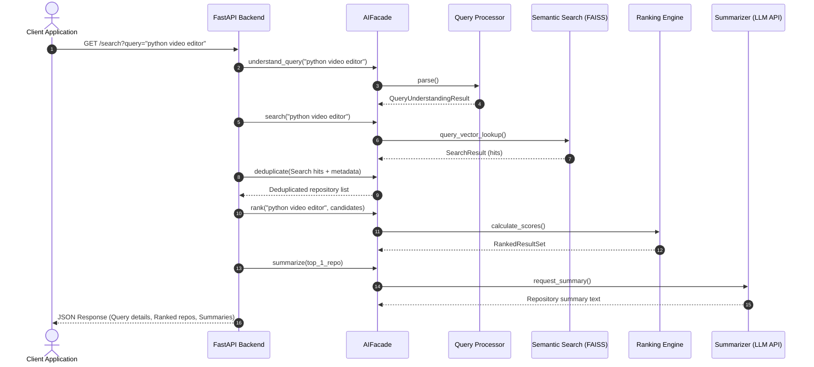

# AI Module Interface Integration Guide

This integration guide defines the interface contract, data schemas, configurations, and initialization steps for integrating the **AI Module** with the Backend API.

---

## 1. Overview

The AI Module acts as the semantic engine of the Repository Discovery Platform, processing raw natural language search queries and returning ranked, deduplicated, and summarized repository search lists. All interactions from external packages must occur exclusively through the [AIFacade](file:///c:/Users/Trinesh/OneDrive/Desktop/AI-Search-Engine/ai-search/ai/facade.py) class.

---

## 2. Module Architecture

The module utilizes a decoupled architecture where components represent dedicated subsystems:

```mermaid
graph TD
    API[FastAPI Backend] ──> AIFacade[AIFacade Entrypoint]
    
    AIFacade ──> QueryEngine[QueryUnderstandingEngine]
    AIFacade ──> EmbedGenerator[EmbeddingGenerator]
    AIFacade ──> SearchEngine[SemanticSearchEngine]
    AIFacade ──> RankingService[RankingService]
    AIFacade ──> Recommender[RecommendationEngine]
    AIFacade ──> Summarizer[SummaryGenerator]
    AIFacade ──> Deduplicator[DuplicateDetector]
```

---

## 3. Configuration & Initialization

### 3.1. Settings & Environment Variables
The module loads settings using Pydantic configurations. These can be set using environment variables prefixed with `AI_`:

| Environment Variable | Type | Default | Description |
|:---|:---:|:---:|:---|
| `AI_MODEL_NAME` | str | `"all-MiniLM-L6-v2"` | Sentence Transformer model name |
| `AI_EMBEDDING_DIM` | int | `384` | Dense vector dimension size |
| `AI_LLM_PROVIDER` | str | `"openai"` | LLM provider: `openai` or `gemini` |
| `AI_OPENAI_API_KEY` | str | `""` | OpenAI authentication API key |
| `AI_OPENAI_MODEL` | str | `"gpt-4o-mini"` | OpenAI model identifier |
| `AI_GEMINI_API_KEY` | str | `""` | Gemini authentication API key |
| `AI_GEMINI_MODEL` | str | `"gemini-2.0-flash"` | Gemini model identifier |
| `AI_CACHE_TTL_SECONDS` | int | `3600` | Expiry duration for query cache |
| `AI_CACHE_MAX_SIZE_MB` | int | `512` | Memory boundary cap for caching |

### 3.2. Instantiation
```python
from ai.facade import AIFacade

# Initialize the facade (loads configuration automatically)
facade = AIFacade(
    embedding_dim=384,
    search_index_path="data/faiss_index.index",
    ranking_config_path="configs/ranking_weights.json"
)

# Optional: pre-load embedding model into RAM/VRAM
facade.warmup_embeddings()
```

---

## 4. Public AIFacade API

### 4.1. `understand_query`
* **Purpose:** Parses a free-text user query to extract semantic structure (domain, intent type, filters, and technologies).
* **Signature:** `understand_query(query: str) -> QueryUnderstandingResult`
* **Parameters:**
  - `query` (str): Raw search query text.
* **Return Type:** [QueryUnderstandingResult](file:///c:/Users/Trinesh/OneDrive/Desktop/AI-Search-Engine/ai-search/ai/query_processor/models.py#L75)
* **Exceptions Raised:** `EmptyQueryError` if query is whitespace-only.
* **Example Usage:**
  ```python
  result = facade.understand_query("best free python video editor for linux")
  print(result.intent)  # IntentType.RECOMMEND
  print(result.programming_languages)  # ["Python"]
  print(result.filters)  # [Filter(type=FilterType.COST, value="free")]
  ```

### 4.2. `search`
* **Purpose:** Performs a semantic vector similarity search against the FAISS repository index.
* **Signature:** `search(query: str, top_k: int = 10, threshold: float = 0.0, boost_exact_match: bool = True) -> SearchResult`
* **Parameters:**
  - `query` (str): Search string.
  - `top_k` (int): Number of nearest neighbors to retrieve.
  - `threshold` (float): Minimum cosine score cut-off (0.0 to 1.0).
  - `boost_exact_match` (bool): Boost scores matching repository name/topics exactly.
* **Return Type:** [SearchResult](file:///c:/Users/Trinesh/OneDrive/Desktop/AI-Search-Engine/ai-search/ai/semantic_search/models.py#L35)
* **Exceptions Raised:** `SearchError` on index lookup failures, `IndexNotBuiltError` if search runs on empty indexes.
* **Example Usage:**
  ```python
  results = facade.search("machine learning tool", top_k=5, threshold=0.5)
  for hit in results.results:
      print(f"ID: {hit.repo_id}, Score: {hit.score}")
  ```

### 4.3. `deduplicate`
* **Purpose:** Groups and filters redundant repositories (e.g. GitLab mirrors) to keep the canonical version.
* **Signature:** `deduplicate(repositories: list[dict[str, Any]]) -> list[dict[str, Any]]`
* **Parameters:**
  - `repositories` (list[dict]): A list of repository dictionaries.
* **Return Type:** `list[dict[str, Any]]`
* **Exceptions Raised:** None.
* **Example Usage:**
  ```python
  repos = [
      {"name": "test-repo", "url": "github.com/a/test-repo", "stars": 100},
      {"name": "test-repo-mirror", "url": "gitlab.com/a/test-repo", "stars": 5}
  ]
  cleaned_repos = facade.deduplicate(repos)
  # Output contains only the GitHub canonical repo, mirror info added to metadata
  ```

### 4.4. `rank`
* **Purpose:** Evaluates and ranks candidate repositories using an 18-factor weighted scoring calculator.
* **Signature:** `rank(query: str, candidates: list[CandidateRepo], intent: Optional[str] = None, top_k: Optional[int] = None) -> RankedResultSet`
* **Parameters:**
  - `query` (str): Original query.
  - `candidates` (list[CandidateRepo]): Repositories loaded with health and activity stats.
  - `intent` (Optional[str]): Extracted query intent.
  - `top_k` (Optional[int]): Cap output items.
* **Return Type:** [RankedResultSet](file:///c:/Users/Trinesh/OneDrive/Desktop/AI-Search-Engine/ai-search/ai/ranking/models.py#L82)
* **Exceptions Raised:** `RankingError` on scoring calculations failure.
* **Example Usage:**
  ```python
  ranked = facade.rank("flask web server", candidate_list, intent="search")
  for item in ranked.results:
      print(f"{item.rank}. {item.repo_id} (Score: {item.final_score})")
  ```

### 4.5. `recommend`
* **Purpose:** Recommends similar repositories using content-based similarities (embeddings, topics, language).
* **Signature:** `recommend(repository_id: str, all_repositories: list[dict[str, Any]], embedding_map: Optional[dict[str, np.ndarray]] = None, top_n: int = 5) -> RecommendationSet`
* **Parameters:**
  - `repository_id` (str): Source repository ID.
  - `all_repositories` (list[dict]): Global catalog repositories.
  - `embedding_map` (Optional[dict]): Precomputed vector dictionary.
  - `top_n` (int): Number of items to recommend.
* **Return Type:** [RecommendationSet](file:///c:/Users/Trinesh/OneDrive/Desktop/AI-Search-Engine/ai-search/ai/recommendation/models.py#L34)
* **Exceptions Raised:** None. Fallback checks return popular repositories on errors.
* **Example Usage:**
  ```python
  recs = facade.recommend("fastapi", catalog)
  for item in recs.recommendations:
      print(f"Recommended: {item.repo_id} - Reason: {item.reason}")
  ```

### 4.6. `summarize`
* **Purpose:** Generates a 2-3 sentence AI summary of a repository.
* **Signature:** `summarize(repository: Any) -> str`
* **Parameters:**
  - `repository` (Any): A repository dict or Repository Pydantic model.
* **Return Type:** `str`
* **Exceptions Raised:** `SummaryError` if the LLM API fails.
* **Example Usage:**
  ```python
  summary = facade.summarize(repo_data)
  print(summary)
  # "FastAPI is a Python-based open-source repository..."
  ```

### 4.7. `compare`
* **Purpose:** Evaluates multiple repositories returning comparative ratings.
* **Signature:** `compare(repositories: list[Any]) -> ComparisonResult`
* **Parameters:**
  - `repositories` (list[Any]): A list of repository models.
* **Return Type:** [ComparisonResult](file:///c:/Users/Trinesh/OneDrive/Desktop/AI-Search-Engine/ai-search/ai/models/comparison.py#L11)
* **Exceptions Raised:** `SummaryError` if LLM analysis fails.
* **Example Usage:**
  ```python
  comparison = facade.compare([repo1, repo2])
  print(comparison.dimensions)  # Dimension scores for Features, Activity, etc.
  print(comparison.recommendation)  # "We recommend repo1..."
  ```

---

## 5. End-to-End Pipeline Execution Flow



---

## 6. Complete Python Integration Example

Here is a script demonstrating how to integrate the complete pipeline:

```python
import sys
from ai.facade import AIFacade
from ai.ranking.models import CandidateRepo

def main():
    # Initialize the facade
    facade = AIFacade()
    
    # Raw query
    query = "best python framework for building api"
    
    # 1. Parse Query
    parsed = facade.understand_query(query)
    print(f"Domain: {parsed.domain}")
    print(f"Tech: {parsed.programming_languages}")
    
    # Mock Repository Database
    raw_catalog = [
        {
            "repo_id": "fastapi", "name": "fastapi", "stars": 85000, "forks": 12000, 
            "description": "Modern, fast API web framework in python", 
            "language": "Python", "url": "https://github.com/tiangolo/fastapi"
        },
        {
            "repo_id": "flask", "name": "flask", "stars": 65000, "forks": 15000, 
            "description": "A micro web framework for python", 
            "language": "Python", "url": "https://github.com/pallets/flask"
        },
        {
            "repo_id": "flask-mirror", "name": "flask", "stars": 120, "forks": 10, 
            "description": "A micro web framework for python clone", 
            "language": "Python", "url": "https://gitlab.com/mirrors/flask"
        }
    ]
    
    # 2. Deduplicate
    deduplicated = facade.deduplicate(raw_catalog)
    print(f"Deduplicated Catalog Size: {len(deduplicated)} (originally {len(raw_catalog)})")
    
    # 3. Vector Indexing & Search
    # Transform catalog into indexable blocks
    search_repos = [
        {"repo_id": r["repo_id"], "text": r["description"], "metadata": r}
        for r in deduplicated
    ]
    facade.build_index(search_repos)
    
    search_res = facade.search(query, top_k=2)
    
    # 4. Multidimensional Ranking
    candidates = []
    for hit in search_res.results:
        # Load detailed metadata
        meta = hit.metadata
        candidates.append(CandidateRepo(
            repo_id=hit.repo_id,
            semantic_score=hit.score,
            stars=meta.get("stars", 0),
            forks=meta.get("forks", 0),
            has_license=True,
            has_readme=True,
            readme_length=5000,
            language=meta.get("language")
        ))
        
    ranked = facade.rank(query, candidates, intent=str(parsed.intent))
    print("\n--- Ranked Results ---")
    for r in ranked.results:
        print(f"#{r.rank}: {r.repo_id} (Weighted Score: {r.final_score:.4f})")
        
    # 5. Optional Summaries
    top_candidate = ranked.results[0]
    repo_meta = next(c for c in deduplicated if c["repo_id"] == top_candidate.repo_id)
    summary = facade.summarize(repo_meta)
    print(f"\n--- AI Summary for {top_candidate.repo_id} ---")
    print(summary)

if __name__ == "__main__":
    main()
```
