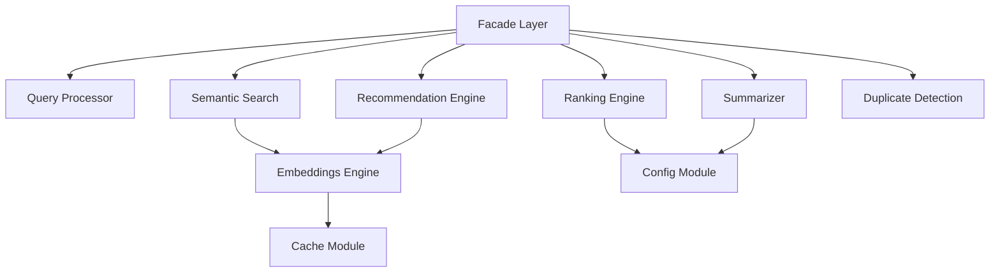
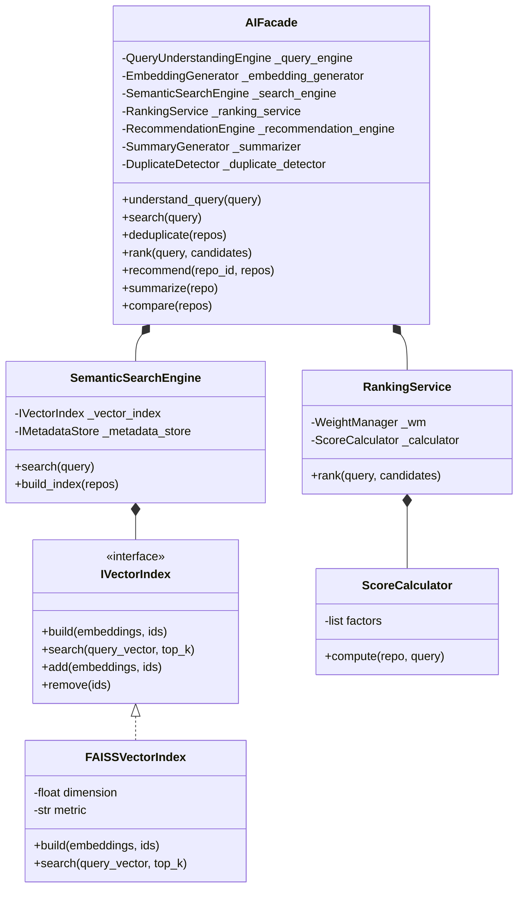
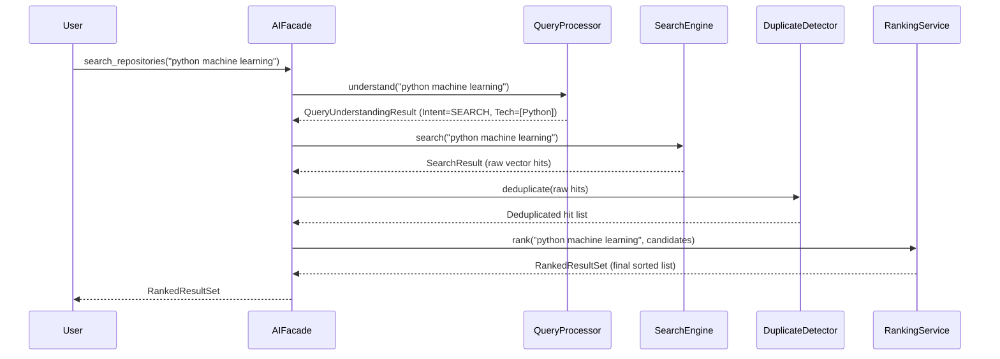

# AI Module Architecture & Engineering Specifications

This document outlines the software engineering architecture, design principles, package responsibilities, and structural diagrams for the **AI Module**.

---

## 1. Directory Structure

The AI module is fully self-contained inside the `ai/` folder, organized by subsystem boundaries:

```
ai/
├── cache/                  # Cache managers
│   ├── __init__.py
│   └── cache_manager.py
├── config/                 # Pydantic environment configurations
│   ├── __init__.py
│   └── settings.py
├── duplicate_detection/    # String-similarity deduplication engine
│   ├── __init__.py
│   └── detector.py
├── embeddings/             # Transformer dense vector encoding
│   ├── __init__.py
│   ├── cache.py
│   ├── generator.py
│   ├── model_manager.py
│   └── strategies.py
├── interfaces/             # Central interface hooks
│   └── __init__.py
├── models/                 # Shared API-level models and exceptions
│   ├── __init__.py
│   ├── comparison.py
│   ├── exceptions.py
│   ├── recommendation.py
│   ├── repository.py
│   └── search_result.py
├── query_processor/        # Natural language parsing & spelling corrector
│   ├── __init__.py
│   ├── engine.py
│   ├── entity_registry.py
│   ├── spelling.py
│   └── synonyms.py
├── ranking/                # 18-factor configurable scoring service
│   ├── __init__.py
│   ├── calculator.py
│   ├── defaults.py
│   ├── factors.py
│   ├── models.py
│   ├── normalization.py
│   ├── service.py
│   └── weight_manager.py
├── recommendation/         # Cosine, Jaccard, and Hybrid recommenders
│   ├── __init__.py
│   ├── engine.py
│   ├── models.py
│   ├── recommender.py
│   └── similarity.py
├── summarizer/             # LLM API generator and comparative metrics
│   ├── __init__.py
│   └── summarizer.py
├── utils/                  # Text processing utilities
│   ├── __init__.py
│   ├── retry.py
│   └── text_utils.py
├── facade.py               # Orchestrator (Single entry point)
└── __init__.py
```

---

## 2. Layered Architecture & Dependency Flow

The AI Module follows a clean **layered architecture** with unidirectional dependency flows:

```
 ┌────────────────────────────────────────────────────────┐
 │                     Orchestration                      │
 │                     - facade.py                        │
 └──────────────────────────┬─────────────────────────────┘
                            ▼
 ┌────────────────────────────────────────────────────────┐
 │                   Subsystem Engines                    │
 │  - query_processor         - semantic_search           │
 │  - duplicate_detection     - ranking                   │
 │  - recommendation          - summarizer                │
 └──────────────────────────┬─────────────────────────────┘
                            ▼
 ┌────────────────────────────────────────────────────────┐
 │                   Core Capabilities                    │
 │  - embeddings              - cache                     │
 └──────────────────────────┬─────────────────────────────┘
                            ▼
 ┌────────────────────────────────────────────────────────┐
 │                  Data & Configurations                 │
 │  - config                  - models                    │
 └────────────────────────────────────────────────────────┘
```

---

## 3. SOLID Design Principles

* **Single Responsibility Principle (SRP):** Each package has exactly one change axis. [DuplicateDetector](file:///c:/Users/Trinesh/OneDrive/Desktop/AI-Search-Engine/ai-search/ai/duplicate_detection/detector.py#L7) resolves codebase duplicates, [SpellingCorrector](file:///c:/Users/Trinesh/OneDrive/Desktop/AI-Search-Engine/ai-search/ai/query_processor/spelling.py#L7) corrects spelling errors, and [ModelManager](file:///c:/Users/Trinesh/OneDrive/Desktop/AI-Search-Engine/ai-search/ai/embeddings/model_manager.py#L11) controls the lifecycle of Torch/Transformer models.
* **Open/Closed Principle (OCP):** Custom score filters or ranking weight changes are applied via external configurations without modifying code logic. New ranking features can be appended by adding a subclass to `BaseFactor` inside [factors.py](file:///c:/Users/Trinesh/OneDrive/Desktop/AI-Search-Engine/ai-search/ai/ranking/factors.py#L13) and appending it to `FACTOR_CLASSES`.
* **Liskov Substitution Principle (LSP):** All vector search databases implement the [IVectorIndex](file:///c:/Users/Trinesh/OneDrive/Desktop/AI-Search-Engine/ai-search/ai/semantic_search/interfaces.py) interface. FAISS can be substituted with Qdrant or Milvus without breaking [SemanticSearchEngine](file:///c:/Users/Trinesh/OneDrive/Desktop/AI-Search-Engine/ai-search/ai/semantic_search/search_engine.py#L19).
* **Interface Segregation Principle (ISP):** Clients depend only on the specific interfaces they invoke. For example, `IExtractor` specifies the single method `extract()` to prevent fat interfaces.
* **Dependency Inversion Principle (DIP):** The orchestrator depends on abstract interfaces (`IVectorIndex`, `IMetadataStore`), decoupling business logic from underlying search libraries.

---

## 4. Package Responsibilities

### 4.1. `embeddings`
Responsible for converting text content into dense floats vectors.
* **Core Mechanisms:** Encapsulates `SentenceTransformer` lifecycle. Formats input segments (README, descriptions, metadata tags) to limit sequence lengths, and maintains an internal LRU memory cache with TTL expiry thresholds.

### 4.2. `query_processor`
Responsible for interpreting raw natural language inputs.
* **Core Mechanisms:** Cleans query strings, queries Levenshtein spelling correctors, resolves aliases or abbreviations against the internal registry, and executes rule-based extractors to detect specific intent types, technology tags, and filters.

### 4.3. `semantic_search`
Responsible for indexing and nearest-neighbor vector retrieval.
* **Core Mechanisms:** Normalizes vectors for Cosine Similarity, interfaces with FAISS, and runs thread-locked mapping tables to bind FAISS integer IDs to repository metadata records.

### 4.4. `ranking`
Responsible for re-evaluating vector search candidates against product-level metrics.
* **Core Mechanisms:** Evaluates 18 discrete factors across repository age, pull request activity, release cycles, stars, and licensing. Normalizes values using log-scale or sigmoid curves and computes weighted averages.

### 4.5. `recommendation`
Generates personalized suggestions for users and repository listings.
* **Core Mechanisms:** Computes Cosine similarity on embeddings, Jaccard coefficients on topic lists, and merges them with user preferences (languages, categories, likes).

### 4.6. `summarizer`
Synthesizes repository contents into structured text and matrices.
* **Core Mechanisms:** Calls OpenAI or Google Gemini clients concurrently. Includes fallback mock generators that output metadata summaries if API keys are missing.

### 4.7. `duplicate_detection`
Identifies duplicate repositories across platforms.
* **Core Mechanisms:** Executes fuzzy string matching on repository names and descriptions to group duplicates, selecting the repository with the highest stars as canonical.

### 4.8. `cache`
Exposes general TTL-based caching logic.
* **Core Mechanisms:** Safe key-value management mapped to expiration timestamps.

### 4.9. `utils`
Provides helpers for retry loops and text formatting.

---

## 5. Architectural Diagrams

### 5.1. Package Relationships


### 5.2. Class Relationships


### 5.3. Pipeline Execution Flow

